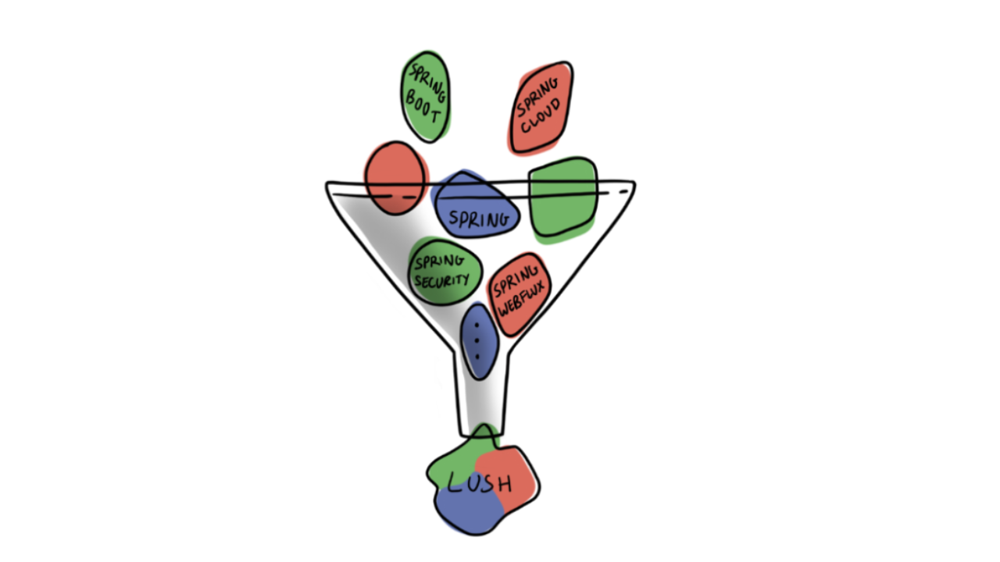

 # Lush Service Architecture

Jump to the [Getting Started Guide](http://www.github.com/paul-parrone/lush-core/blob/master/docs/getting-started.md).

## Introduction
In this day and age of libraries and frameworks stacked on top of libraries and frameworks, it can be quite daunting to narrow down and pick the optimal set of components to design and build a service.

By design, frameworks such as Spring exist to solve a very broad range of problems (and they do that quite well) - some of these things we need for our applications and others we don't.  The design of Spring reflects this, you choose what you need for your particular application (and ignore what you don't) and the framework ensures that those chosen components work together as easily as possible.

This begs the question - How does one go from the seemingly endless functionality of frameworks such as Spring down to an architecture that supports the services we need to build for our application?  This is where the ideas behind Lush come from.

Lush is born of multiple iterations of service architecture that I have had the good fortune to build (on top of the vast Spring Framework) over the years.  If you think of it in visual terms, Lush is what comes out if we were to pour the entire Spring Framework through a **service architecture funnel**.



**Lush doesn't try to wrap or hide the Spring Framework at all, nor does it try to change the way we do things**.  It simply provides a pre-assembled set of components that already work together, thus giving you a head start at building production ready services.  If Spring is a bunch of individual blocks, Lush is a portion of those blocks partially assembled.

I've been fortunate to build quite a few systems from the ground up.  I have always found that there is a necessary amount of infrastructure code and design patterns necessary to start and build a consistent and reliable service.  Infrastructure that answers the following questions (not an all-inclusive list):

* What exception handling guidelines should the team follow - and how can we make it as seamless as possible?
* How can the maximum amount of boilerplate code be removed from the system - especially from developer responsibility?
* How can all endpoints return data and metadata consistently to service consumers (often a web based UI)?
* How should services be secured?
* How is user information (identifiers, roles, etc.) propagated into and across services?
* How should we make it as simple as possible for our support team to quickly find problems when things go wrong?

I believe that a service architecture should provide simple, understandable metaphors.  It strives to take common higher-level decisions out of developers hands - and does so as seamlessly as possible.  Lush is my technique to build something that does just these things.

With all of that said, lets get into some details.

## Overview
As stated earlier, think of Lush as a pre-assembled set of building blocks - below are the Spring components already integrated into Lush:

* **Spring Boot**
  * Nothing much to say here just that all Lush services are based on Spring Boot.


* **Spring WebFlux**
  * Simple annotation (**@LushControllerMethod**) to inject Lush behaviors into Controllers.
  * Automatically inject Lush Ticket and/or LushContext as desired.
  * Lush Advice is automatically propagated to the caller of the Controller method.
  * Lush provides automatic exception handling around Controller Endpoint methods.


* **Spring Security**
  * Spring Security preconfigured, Lush Ticket abstraction already integrated.
  * Configurable secure/insecure paths.
  * Seamless use of Spring Security related annotations (@PreAuthorize, @PostAuthorize).


* **Spring Cloud Discovery**
  * Discovery automatically enabled in all Lush Services.
  * For local development, Lush uses Consul for service discovery.


* **Spring Cloud Sleuth**
  * Already configured to capture the current user of a service.
  * Extra baggage field added so that original user is carried through all Lush service calls.


* **Spring Boot Actuator**
  * Already included in the starter and preconfigured.

In addition to the preconfigured Spring building blocks, Lush provides a number of other benefits:

#### Consistent Logging and Exception Handling
* Username present in and across all Lush service logs.
* Spring Cloud Sleuth is preconfigured - unique trace id is transferred across Lush Services.
* Leave the exception handling to Lush - your developers have enough to worry about.

#### General
* Maven Archetype makes it trivial quickly create a Lush service.
* Lush 'starter' POM to easily add Lush to any existing services.

#### Rich Protocol
* Based on Spring WebFlux
* Lush Advice - automatically provided by the architecture and sent back to callers
* JavaScript code to interpret and react to Lush Protocol.

#### Monitoring
* JSON formatted logs
* Spring Boot Actuator preconfigured

#### Aids in development
* Special **developer** profile to provide out-of-box settings when run on a developers computer.
* A **clear-ticket** profile to allow a clear text JSON Lush Ticket to access secured services.

Now that we have all that out of the way, let's introduce a few of the core concepts of Lush.  I won't get into too much detail here as I feel the best way to understand it is to view the code and see it in action.  The Getting Started guide will cover the concepts in more detail.

## Lush Concepts
Lush introduces a few simple concepts that you can add to your existing knowledge of Spring.

* Entry point
* Consistent Exception Handling 
* Lush Context
* Lush Advice
* Lush Ticket

#### Entry Point
Lush views an Entry Point as the those places where our service functionality is exposed to consumers.  In many cases this is through a REST endpoint (Controller).  Lush also has built in support for exposing service functionality via JMS - with more to come.  Lush injects much of its magic on inbound/outbound traffic through Entry Points.

I won't go too deep into these concepts here as it will become clear once you create your first service (from the Maven archetype) and view the [Getting Started](http://www.github.com/paul-parrone/lush-core/blob/master/docs/getting-started.md) guide.

#### Consistent Exception Handling
Lush provides automatic and consistent exception handling.  Through this mechanism, you can be sure that any unexpected and/or expected exceptions will be handled in an appropriate and consistent manner.

Let's consider two scenarios.  First an unexpected exception that bubbles up to the architecture layer.  This is the most common case and enables developers to almost not think about exception handling (and at the same time not sacrificing robustness).  In this case Lush will do the following:

1. Catch the exception.
2. Log the exception with appropriate request context detail (traceId, user, etc.)
3. Populate a LushAdvice instance with the special status code of **-99** and an _extra_ of **lush.isUnexpectedException** set to the value of true.

Second, an endpoint that chooses to handle an exception itself.  In this case, the developer can catch the underlying exception and make use the LushAdvice mechanism to signal the condition to the consumer - this is useful if the consumer is expected to perform some specific action under this condition.


#### Lush Context
LushContext is a simple object containing an instance of LushAdvice (described below) and a unique trace id for the current request.
```java
public class LushContext {
    private LushAdvice advice;
    private String traceId;
}
```

#### Lush Advice
LushAdvice provides a common mechanism for returning metadata to the consumer of Lush services.  LushAdvice is loosely modeled around the JDBC MetaData mechanism.

You obtain access to the LushAdvice instance for a given request by simply declaring LushContext as a parameter to your endpoint method.  Note that Lush itself reserves _statusCodes_ from -1 to -100 for its own use.


| Member     | Description                                                               | Usage                                                                                                                                                                                                |
|------------|---------------------------------------------------------------------------|------------------------------------------------------------------------------------------------------------------------------------------------------------------------------------------------------|
| traceId    | The unique traceId for the current request                                | Used mainly by Lush but accessible if you should need it.                                                                                                                                            |
| statusCode | The application status code (this is different than the HTTP status code) | This is the overall application defined status code for the request - use to signify application warnings/failures to your callers (not the same as HTTP status code).                               |
| warnings   | List of LushWarning objects that can be returned to the caller            | Warnings that the caller should respond to.  Each instance includes a code and some details.  You can use this to send data back to the caller but also signal that there could be potential issues. |
| extras     | Map of any key/value pairs that are relevant to your use case             | Any other information you want to send back to the caller.                                                                                                                                           |  
#### Lush Ticket
Lush Ticket is how callers gain access to any Lush based service.  Out of the box, Lush comes with Spring Security preconfigured to deny access without a Lush Ticket.

Lush doesn't define how Lush Tickets are created - it is extensible enough to carry any information related to your particular use-case.  

By default, Lush Tickets are expected to be encrypted (with the keys shared between the issuer and each Lush service).  There is a predefined profile: **clear-text** that lets you supply the Lush Ticket as JSON as clear text.

#### Lush Annotations
Last but not least, I wanted to introduce you to Lush Annotations.  Most of Lush's features are injected into your code by using these annotations, they are defined below. 

| Annotation            | Usage                                                                                                 |
|-----------------------|-------------------------------------------------------------------------------------------------------|
| @LushControllerMethod | Tells Lush to inject it's behavior, typically used on Controller methods exposed via @RequestMapping. |

Hopefully this has given a good overview of what Lush is and how it can help you. Please view the [Getting Started](http://www.github.com/paul-parrone/lush-core/blob/master/docs/getting-started.md) guide to get a quick hands on overview of Lush.
