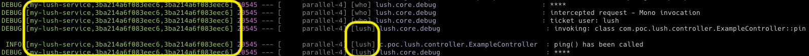
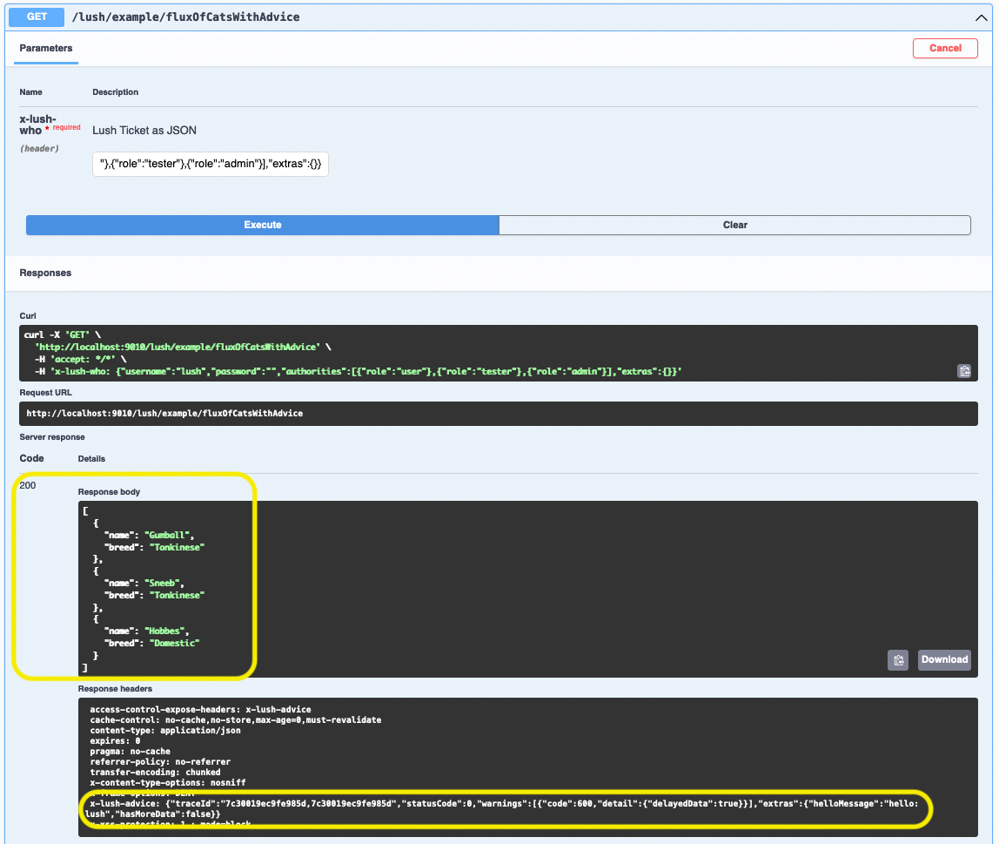

# Lush - Getting Started 

## Overview
This getting started guide will take you through the steps required to create a service based on Lush.  Once the service is created, we will take an in-depth look to explore each Lush concept.

### Create Your First Service
This section will show you how to use the Lush Maven archetype to create your first Lush service.  We will assume a command line in this document, but feel free to use your favorite IDE if you'd like.

#### Generate from the Lush Service Archetype
```shell
mvn archetype:generate -DarchetypeGroupId=com.px3j -DarchetypeArtifactId=lush-service -DarchetypeVersion=2022.9.3 -DgroupId=com.poc -DartifactId=my-lush-service
```

If all goes well, you should see a new service created below your current working directory.  Change to that directory then run the maven command below to build the service.  

In the commands below, you may need to change **my-lush-service** to your service name, depending on what you chose when creating the service.

#### Build the service
```shell
mvn -Pdeveloper clean package
```

Note that we are using the developer maven profile as we are running it on our local machine - there's more detail on that at the bottom of this guide.  

If all goes well, your service will be built and the test cases will be run.  You'll see a bunch of output from the test cases, you can ignore that for now.

Next up, let's run the service.  The maven command above will have built a 'fat jar' that contains all required dependencies.  Execute the java command below in your terminal (change the jar name if necessary). 

#### Run the service

```shell
java -Dspring.profiles.active=clear-ticket -jar target/my-lush-service-1.0-SNAPSHOT.jar
```

---

**Note:** We are activating the __clear-ticket__ Spring profile so that the Lush Ticket can be supplied to the service in plain text.

---

Now that the service is running, your terminal screen should look something like this:


### Let's Explore
As we have discussed, one of the benefits of using Lush is that you have a head-start on creating production ready services.  Swagger is already integrated and ready to be used, so for this section, we will explore using the Swagger UI.

Fire up your favorite browser and navigate to the: [http://localhost:9010/swagger-ui.html](http://localhost:9010/swagger-ui.html)

#### We need a Lush Ticket
Before we can actually invoke any of the endpoints, we need to make sure we have a ticket (Swagger is pre-configured to allow you to enter a Lush Ticket).  And wouldn't you know we happen to have one below:

```json
{"username":"lush-user","password":"","authorities":[{"role":"user"},{"role":"tester"},{"role":"admin"}],"extras":{}}
```

This is another gain of using Lush - Spring Security is pre-configured and already enabled in any Lush service.

To simplify development, you can use an unencrypted Lush Ticket in JSON format.  In a later section, there is an explanation on how to configure your Lush service to require an encrypted Lush Ticket.  For now, we will continue with the clear text version.

#### What's an endpoint?
Before we dig any deeper, I wanted to give a short definition of what Lush considers an endpoint (or entrypoint).  This is the point in any Lush service that is exposed to consumers.  This is important as this is where Lush injects much of its magic.  

It'll make more sense as we move along.  For purposes of this document we will focus on HTTP endpoints.  The controller that we are going to go through is included in the generated service.  There are other illustrative methods in the controller (in addition to what we will discuss here) - feel free to investigate them.

#### The ping() endpoint
This is one of the simplest cases.  This endpoint takes no parameters and returns an instance of __AnyModel__.  Since Lush expects returned data to be in JSON format, we can return instances of AnyModel if there is no need for a proper Java class to represent the returned data.

##### The Code


A few things to note:
1. On line 39 you'll find the **@LushControllerMethod** annotation - this tells Lush to inject it's magic around the endpoint.


2. Line 41 contains the Spring @PreAuthorize annotation - nothing special here except to note that all Lush services have Spring Security pre-configured - you don't have to do anything for this behavior.


3. The return type is a Mono - Lush is built on Spring WebFlux.


4. This is a basic Spring controller endpoint method, we've only added the Lush annotation.

##### Invoke It

Time to invoke the endpoint.  In the Swagger UI, expand the **/lush/example/ping** method.  Before invoking the endpoint paste in the sample JSON Lush Ticket from above.


In the image above, let's first glance at the Response body.  Nothing special there, just a single JSON object with a message property.

Next, I want to point out the _x-lush-advice_ response header - you'll see it highlighted in the response headers section.  This is automatically injected by Lush.  While not specifically used in this endpoint, it does show how data and advice can be returned from one endpoint.  

One thing to note is the traceId property (_3ba214a6f083eec6,3ba214a6f083eec6_ in this case).  The traceId is unique to this request and will be carried by Lush throughout the chain of calls in the backend - even across Lush services.  

View the service log output, you should see something similar to the image below.  Notice that the traceId is visible in each log statement.  Also, the user name is present in all log statements (as shown by the smaller highlight square).



##### Summary

That completes the dive into a simple Lush HTTP endpoint.  Let's summarize what have we learned.

1. Lush services come with Swagger already integrated and pre-configured to accept a Lush Ticket. 


2. All Lush services come with Spring Security pre-configured.  Access to services is granted via a Lush Ticket.


3. A Lush Ticket can be encrypted or clear text.  You can add any extra information to a Lush Ticket that suits your use case.

 
4. Lush is based on Spring WebFlux.


5. Lush endpoints can return both data and advice.  Lush injects a Lush Advice instance into your endpoint if desired, as shown below, and automatically sends it back to the caller.


6. Lush services come with Spring Cloud Sleuth pre-configured.
   * All requests are assigned a unique request id.  This request id is returned to the caller, is present in all log statements and is propagated across all Lush service calls.
   * The Lush Ticket contains the calling username, this is also present in the log statements and propagated across all Lush service calls.
 
#### The fluxOfCatsWithAdvice() endpoint
This endpoint illustrates how you can use the LushAdvice mechanism to return other information (besides data) to the caller.   

##### The Code


A few things to note
1. On line 93 we are declaring both a LushTicket instance and a LushContext instance.  All you have to do is declare them as parameters and lush will inject them for you.
2. The @Parameter is there to tell Swagger to ignore these parameters.

On line 97, we access the LushAdvice instance from the LushContext.  As discussed earlier, this is the Lush mechanism to use in order to send metadata type information to the caller of the endpoint. 


##### Invoke It

Nothing special here, we invoke it the same way we did the previous method.  Since Lush injects the LushTicket and LushContext, we don't need to provide it.



In the image above, not that we see the data returned from the endpoint (as marked by the large yellow square).

At the bottom of the image we see the JSON formatted LushAdvice instance.  You'll notice that it contains the values that were set in the endpoint method.

##### Summary

This section illustrated a few more elements of Lush.

1. You can return collections of data by using a Flux (since Lush is built on Spring WebFlux).


2. LushAdvice can be used to return extra information to the caller of the endpoint.  


#### The uaeNoLush() endpoint
In this section, let's take a look at how Lush helps with exception handling.  

##### The Code


Nothing much to say about this code except to note that on Line 198 we have a handy method that throws an unchecked exception - needless to say, don't do this in real code :)

##### Invoke It

Back to our Swagger API, let's invoke the GET method on __uaeNoLush endpoint__.  For illustrative purposes, I'm leaving out the request part of the Swagger screenshot as for this section we will focus solely on the response.


In the first highlighted section, you'll notice that the HTTP status code is 500 - now while this is good for signifying an HTTP error, this is an actual application error.  The next section will illustrate how Lush handles this scenario.

The second highlighted section just shows the Lush Advice - it's a default set of values as Lush didn't get to intercept this request.  Again, in the next section we'll see how Lush makes use of the Lush Advice concept to signify the error to the caller.

##### Service Output

Immediately below is just an excerpt from the service output generated for this call.  You can expand the section below to view the full output (it's huge!).
```text
2022-08-08 18:10:45.889 ERROR [my-lush-service,b2ba2662c136bfd9,b2ba2662c136bfd9] 37203 --- [     parallel-4] [who] a.w.r.e.AbstractErrorWebExceptionHandler : [4306eb0e-4]  500 Server Error for HTTP GET "/lush/example/uaeNoLush"

com.px3j.lush.core.exception.LushException: Illustrate Exception Handling
	at com.poc.lush.controller.ExampleController.methodThatThrowsUnexpectedException(ExampleController.java:243)
	Suppressed: reactor.core.publisher.FluxOnAssembly$OnAssemblyException:
Error has been observed at the following site(s):
	*__checkpoint ⇢ Handler com.poc.lush.controller.ExampleController#uaeNoLush(LushTicket) [DispatcherHandler]
	*__checkpoint ⇢ com.px3j.lush.endpoint.http.reactive.EndpointFilter [DefaultWebFilterChain]
	*__checkpoint ⇢ org.springframework.security.web.server.authorization.AuthorizationWebFilter [DefaultWebFilterChain]
	*__checkpoint ⇢ org.springframework.security.web.server.authorization.ExceptionTranslationWebFilter [DefaultWebFilterChain]
	*__checkpoint ⇢ org.springframework.security.web.server.authentication.logout.LogoutWebFilter [DefaultWebFilterChain]
	*__checkpoint ⇢ org.springframework.security.web.server.savedrequest.ServerRequestCacheWebFilter [DefaultWebFilterChain]
	*__checkpoint ⇢ org.springframework.security.web.server.context.SecurityContextServerWebExchangeWebFilter [DefaultWebFilterChain]
	*__checkpoint ⇢ org.springframework.security.web.server.context.ReactorContextWebFilter [DefaultWebFilterChain]
	*__checkpoint ⇢ org.springframework.security.web.server.header.HttpHeaderWriterWebFilter [DefaultWebFilterChain]
	*__checkpoint ⇢ org.springframework.security.config.web.server.ServerHttpSecurity$ServerWebExchangeReactorContextWebFilter [DefaultWebFilterChain]
	*__checkpoint ⇢ org.springframework.security.web.server.WebFilterChainProxy [DefaultWebFilterChain]
	*__checkpoint ⇢ org.springframework.cloud.sleuth.instrument.web.TraceWebFilter [DefaultWebFilterChain]
	*__checkpoint ⇢ org.springframework.boot.actuate.metrics.web.reactive.server.MetricsWebFilter [DefaultWebFilterChain]
	*__checkpoint ⇢ HTTP GET "/lush/example/uaeNoLush" [ExceptionHandlingWebHandler]
Original Stack Trace:
		at com.poc.lush.controller.ExampleController.methodThatThrowsUnexpectedException(ExampleController.java:243)
		at com.poc.lush.controller.ExampleController.uaeNoLush(ExampleController.java:198)
		at com.poc.lush.controller.ExampleController$$FastClassBySpringCGLIB$$7a0e452d.invoke(<generated>)
```

I'd like to point out that only the first line has the traceId and if we were to grep our logs for that requestId all we would see is:

```text
2022-08-08 18:10:45.889 ERROR [my-lush-service,b2ba2662c136bfd9,b2ba2662c136bfd9] 37203 --- [     parallel-4] [who] a.w.r.e.AbstractErrorWebExceptionHandler : [4306eb0e-4]  500 Server Error for HTTP GET "/lush/example/uaeNoLush"
```

This line is not very helpful if we are trying to quickly find a problem.  

<details>
  <summary>
    Open this section to view the full service output (no lush)
  </summary>
   <pre>
2022-08-08 18:10:45.889 ERROR [my-lush-service,b2ba2662c136bfd9,b2ba2662c136bfd9] 37203 --- [     parallel-4] [who] a.w.r.e.AbstractErrorWebExceptionHandler : [4306eb0e-4]  500 Server Error for HTTP GET "/lush/example/uaeNoLush"

com.px3j.lush.core.exception.LushException: Illustrate Exception Handling
at com.poc.lush.controller.ExampleController.methodThatThrowsUnexpectedException(ExampleController.java:243)
Suppressed: reactor.core.publisher.FluxOnAssembly$OnAssemblyException:
Error has been observed at the following site(s):
*__checkpoint ⇢ Handler com.poc.lush.controller.ExampleController#uaeNoLush(LushTicket) [DispatcherHandler]
*__checkpoint ⇢ com.px3j.lush.endpoint.http.reactive.EndpointFilter [DefaultWebFilterChain]
*__checkpoint ⇢ org.springframework.security.web.server.authorization.AuthorizationWebFilter [DefaultWebFilterChain]
*__checkpoint ⇢ org.springframework.security.web.server.authorization.ExceptionTranslationWebFilter [DefaultWebFilterChain]
*__checkpoint ⇢ org.springframework.security.web.server.authentication.logout.LogoutWebFilter [DefaultWebFilterChain]
*__checkpoint ⇢ org.springframework.security.web.server.savedrequest.ServerRequestCacheWebFilter [DefaultWebFilterChain]
*__checkpoint ⇢ org.springframework.security.web.server.context.SecurityContextServerWebExchangeWebFilter [DefaultWebFilterChain]
*__checkpoint ⇢ org.springframework.security.web.server.context.ReactorContextWebFilter [DefaultWebFilterChain]
*__checkpoint ⇢ org.springframework.security.web.server.header.HttpHeaderWriterWebFilter [DefaultWebFilterChain]
*__checkpoint ⇢ org.springframework.security.config.web.server.ServerHttpSecurity$ServerWebExchangeReactorContextWebFilter [DefaultWebFilterChain]
*__checkpoint ⇢ org.springframework.security.web.server.WebFilterChainProxy [DefaultWebFilterChain]
*__checkpoint ⇢ org.springframework.cloud.sleuth.instrument.web.TraceWebFilter [DefaultWebFilterChain]
*__checkpoint ⇢ org.springframework.boot.actuate.metrics.web.reactive.server.MetricsWebFilter [DefaultWebFilterChain]
*__checkpoint ⇢ HTTP GET "/lush/example/uaeNoLush" [ExceptionHandlingWebHandler]
Original Stack Trace:
at com.poc.lush.controller.ExampleController.methodThatThrowsUnexpectedException(ExampleController.java:243)
at com.poc.lush.controller.ExampleController.uaeNoLush(ExampleController.java:198)
at com.poc.lush.controller.ExampleController$$FastClassBySpringCGLIB$$7a0e452d.invoke(<generated>)
at org.springframework.cglib.proxy.MethodProxy.invoke(MethodProxy.java:218)
at org.springframework.aop.framework.CglibAopProxy$CglibMethodInvocation.invokeJoinpoint(CglibAopProxy.java:793)
at org.springframework.aop.framework.ReflectiveMethodInvocation.proceed(ReflectiveMethodInvocation.java:163)
at org.springframework.aop.framework.CglibAopProxy$CglibMethodInvocation.proceed(CglibAopProxy.java:763)
at org.springframework.security.access.prepost.PrePostAdviceReactiveMethodInterceptor.proceed(PrePostAdviceReactiveMethodInterceptor.java:156)
at org.springframework.security.access.prepost.PrePostAdviceReactiveMethodInterceptor.lambda$invoke$4(PrePostAdviceReactiveMethodInterceptor.java:116)
at reactor.core.publisher.MonoFlatMap$FlatMapMain.onNext(MonoFlatMap.java:125)
at reactor.core.publisher.FluxSwitchIfEmpty$SwitchIfEmptySubscriber.onNext(FluxSwitchIfEmpty.java:74)
at reactor.core.publisher.FluxFilter$FilterSubscriber.onNext(FluxFilter.java:113)
at reactor.core.publisher.FluxDefaultIfEmpty$DefaultIfEmptySubscriber.onNext(FluxDefaultIfEmpty.java:101)
at reactor.core.publisher.FluxMapFuseable$MapFuseableSubscriber.onNext(FluxMapFuseable.java:129)
at reactor.core.publisher.Operators$MonoSubscriber.complete(Operators.java:1816)
at reactor.core.publisher.MonoFlatMap$FlatMapMain.onNext(MonoFlatMap.java:151)
at reactor.core.publisher.FluxFilterFuseable$FilterFuseableSubscriber.onNext(FluxFilterFuseable.java:118)
at org.springframework.cloud.sleuth.instrument.reactor.ScopePassingSpanSubscriber.onNext(ScopePassingSpanSubscriber.java:89)
at reactor.core.publisher.Operators$ScalarSubscription.request(Operators.java:2398)
at org.springframework.cloud.sleuth.instrument.reactor.ScopePassingSpanSubscriber.request(ScopePassingSpanSubscriber.java:75)
at reactor.core.publisher.FluxFilterFuseable$FilterFuseableSubscriber.request(FluxFilterFuseable.java:191)
at reactor.core.publisher.MonoFlatMap$FlatMapMain.onSubscribe(MonoFlatMap.java:110)
at reactor.core.publisher.FluxFilterFuseable$FilterFuseableSubscriber.onSubscribe(FluxFilterFuseable.java:87)
at org.springframework.cloud.sleuth.instrument.reactor.ScopePassingSpanSubscriber.onSubscribe(ScopePassingSpanSubscriber.java:68)
at reactor.core.publisher.MonoCurrentContext.subscribe(MonoCurrentContext.java:36)
at reactor.core.publisher.InternalMonoOperator.subscribe(InternalMonoOperator.java:64)
at reactor.core.publisher.MonoFlatMap$FlatMapMain.onNext(MonoFlatMap.java:157)
at reactor.core.publisher.Operators$MonoSubscriber.complete(Operators.java:1816)
at reactor.core.publisher.MonoFlatMap$FlatMapInner.onNext(MonoFlatMap.java:249)
at reactor.core.publisher.FluxOnErrorResume$ResumeSubscriber.onNext(FluxOnErrorResume.java:79)
at reactor.core.publisher.FluxPeek$PeekSubscriber.onNext(FluxPeek.java:200)
at reactor.core.publisher.FluxPeek$PeekSubscriber.onNext(FluxPeek.java:200)
at org.springframework.cloud.sleuth.instrument.reactor.ScopePassingSpanSubscriber.onNext(ScopePassingSpanSubscriber.java:89)
at reactor.core.publisher.MonoIgnoreThen$ThenIgnoreMain.complete(MonoIgnoreThen.java:292)
at reactor.core.publisher.MonoIgnoreThen$ThenIgnoreMain.onNext(MonoIgnoreThen.java:187)
at reactor.core.publisher.Operators$MonoSubscriber.complete(Operators.java:1816)
at reactor.core.publisher.MonoFlatMap$FlatMapMain.onNext(MonoFlatMap.java:151)
at reactor.core.publisher.Operators$MonoSubscriber.complete(Operators.java:1816)
at reactor.core.publisher.MonoZip$ZipCoordinator.signal(MonoZip.java:251)
at reactor.core.publisher.MonoZip$ZipInner.onNext(MonoZip.java:336)
at org.springframework.cloud.sleuth.instrument.reactor.ScopePassingSpanSubscriber.onNext(ScopePassingSpanSubscriber.java:89)
at reactor.core.publisher.MonoPeekTerminal$MonoTerminalPeekSubscriber.onNext(MonoPeekTerminal.java:180)
at reactor.core.publisher.FluxDefaultIfEmpty$DefaultIfEmptySubscriber.onNext(FluxDefaultIfEmpty.java:101)
at reactor.core.publisher.FluxHide$SuppressFuseableSubscriber.onNext(FluxHide.java:137)
at org.springframework.cloud.sleuth.instrument.reactor.ScopePassingSpanSubscriber.onNext(ScopePassingSpanSubscriber.java:89)
at reactor.core.publisher.MonoIgnoreThen$ThenIgnoreMain.complete(MonoIgnoreThen.java:292)
at reactor.core.publisher.MonoIgnoreThen$ThenIgnoreMain.onNext(MonoIgnoreThen.java:187)
at reactor.core.publisher.MonoIgnoreThen$ThenIgnoreMain.subscribeNext(MonoIgnoreThen.java:236)
at reactor.core.publisher.MonoIgnoreThen$ThenIgnoreMain.onComplete(MonoIgnoreThen.java:203)
at org.springframework.cloud.sleuth.instrument.reactor.ScopePassingSpanSubscriber.onComplete(ScopePassingSpanSubscriber.java:103)
at reactor.core.publisher.MonoPeekTerminal$MonoTerminalPeekSubscriber.onComplete(MonoPeekTerminal.java:299)
at reactor.core.publisher.MonoPeekTerminal$MonoTerminalPeekSubscriber.onComplete(MonoPeekTerminal.java:299)
at reactor.core.publisher.MonoIgnoreElements$IgnoreElementsSubscriber.onComplete(MonoIgnoreElements.java:89)
at reactor.core.publisher.FluxPeek$PeekSubscriber.onComplete(FluxPeek.java:260)
at reactor.core.publisher.FluxMap$MapSubscriber.onComplete(FluxMap.java:144)
at reactor.core.publisher.Operators$MonoSubscriber.complete(Operators.java:1817)
at reactor.core.publisher.MonoZip$ZipCoordinator.signal(MonoZip.java:251)
at reactor.core.publisher.MonoZip$ZipInner.onNext(MonoZip.java:336)
at org.springframework.cloud.sleuth.instrument.reactor.ScopePassingSpanSubscriber.onNext(ScopePassingSpanSubscriber.java:89)
at reactor.core.publisher.Operators$MonoSubscriber.complete(Operators.java:1816)
at reactor.core.publisher.MonoCacheTime.subscribeOrReturn(MonoCacheTime.java:151)
at reactor.core.publisher.Mono.subscribe(Mono.java:4385)
at reactor.core.publisher.MonoZip.subscribe(MonoZip.java:128)
at reactor.core.publisher.Mono.subscribe(Mono.java:4400)
at reactor.core.publisher.MonoIgnoreThen$ThenIgnoreMain.subscribeNext(MonoIgnoreThen.java:263)
at reactor.core.publisher.MonoIgnoreThen.subscribe(MonoIgnoreThen.java:51)
at reactor.core.publisher.Mono.subscribe(Mono.java:4400)
at reactor.core.publisher.FluxFlatMap.trySubscribeScalarMap(FluxFlatMap.java:203)
at reactor.core.publisher.MonoFlatMap.subscribeOrReturn(MonoFlatMap.java:53)
at reactor.core.publisher.Mono.subscribe(Mono.java:4385)
at reactor.core.publisher.MonoZip.subscribe(MonoZip.java:128)
at reactor.core.publisher.InternalMonoOperator.subscribe(InternalMonoOperator.java:64)
at reactor.core.publisher.MonoDefer.subscribe(MonoDefer.java:52)
at reactor.core.publisher.MonoIgnoreThen$ThenIgnoreMain.subscribeNext(MonoIgnoreThen.java:240)
at reactor.core.publisher.MonoIgnoreThen$ThenIgnoreMain.onComplete(MonoIgnoreThen.java:203)
at org.springframework.cloud.sleuth.instrument.reactor.ScopePassingSpanSubscriber.onComplete(ScopePassingSpanSubscriber.java:103)
at reactor.core.publisher.MonoFlatMap$FlatMapMain.onComplete(MonoFlatMap.java:181)
at reactor.core.publisher.Operators.complete(Operators.java:137)
at reactor.core.publisher.MonoZip.subscribe(MonoZip.java:120)
at reactor.core.publisher.Mono.subscribe(Mono.java:4400)
at reactor.core.publisher.MonoIgnoreThen$ThenIgnoreMain.subscribeNext(MonoIgnoreThen.java:263)
at reactor.core.publisher.MonoIgnoreThen.subscribe(MonoIgnoreThen.java:51)
at reactor.core.publisher.InternalMonoOperator.subscribe(InternalMonoOperator.java:64)
at reactor.core.publisher.MonoFlatMap$FlatMapMain.onNext(MonoFlatMap.java:157)
at reactor.core.publisher.FluxSwitchIfEmpty$SwitchIfEmptySubscriber.onNext(FluxSwitchIfEmpty.java:74)
at reactor.core.publisher.MonoNext$NextSubscriber.onNext(MonoNext.java:82)
at reactor.core.publisher.FluxConcatMap$ConcatMapImmediate.innerNext(FluxConcatMap.java:282)
at reactor.core.publisher.FluxConcatMap$ConcatMapInner.onNext(FluxConcatMap.java:863)
at org.springframework.cloud.sleuth.instrument.reactor.ScopePassingSpanSubscriber.onNext(ScopePassingSpanSubscriber.java:89)
at reactor.core.publisher.FluxMapFuseable$MapFuseableSubscriber.onNext(FluxMapFuseable.java:129)
at reactor.core.publisher.MonoPeekTerminal$MonoTerminalPeekSubscriber.onNext(MonoPeekTerminal.java:180)
at reactor.core.publisher.Operators$ScalarSubscription.request(Operators.java:2398)
at reactor.core.publisher.MonoPeekTerminal$MonoTerminalPeekSubscriber.request(MonoPeekTerminal.java:139)
at reactor.core.publisher.FluxMapFuseable$MapFuseableSubscriber.request(FluxMapFuseable.java:171)
at org.springframework.cloud.sleuth.instrument.reactor.ScopePassingSpanSubscriber.request(ScopePassingSpanSubscriber.java:75)
at reactor.core.publisher.Operators$MultiSubscriptionSubscriber.set(Operators.java:2194)
at reactor.core.publisher.Operators$MultiSubscriptionSubscriber.onSubscribe(Operators.java:2068)
at org.springframework.cloud.sleuth.instrument.reactor.ScopePassingSpanSubscriber.onSubscribe(ScopePassingSpanSubscriber.java:68)
at reactor.core.publisher.FluxMapFuseable$MapFuseableSubscriber.onSubscribe(FluxMapFuseable.java:96)
at reactor.core.publisher.MonoPeekTerminal$MonoTerminalPeekSubscriber.onSubscribe(MonoPeekTerminal.java:152)
at reactor.core.publisher.MonoJust.subscribe(MonoJust.java:55)
at reactor.core.publisher.Mono.subscribe(Mono.java:4400)
at reactor.core.publisher.FluxConcatMap$ConcatMapImmediate.drain(FluxConcatMap.java:451)
at reactor.core.publisher.FluxConcatMap$ConcatMapImmediate.onSubscribe(FluxConcatMap.java:219)
at reactor.core.publisher.FluxIterable.subscribe(FluxIterable.java:165)
at reactor.core.publisher.FluxIterable.subscribe(FluxIterable.java:87)
at reactor.core.publisher.InternalMonoOperator.subscribe(InternalMonoOperator.java:64)
at reactor.core.publisher.MonoDefer.subscribe(MonoDefer.java:52)
at reactor.core.publisher.InternalMonoOperator.subscribe(InternalMonoOperator.java:64)
at reactor.core.publisher.MonoDefer.subscribe(MonoDefer.java:52)
at reactor.core.publisher.MonoDefer.subscribe(MonoDefer.java:52)
at reactor.core.publisher.Mono.subscribe(Mono.java:4400)
at reactor.core.publisher.FluxSwitchIfEmpty$SwitchIfEmptySubscriber.onComplete(FluxSwitchIfEmpty.java:82)
at reactor.core.publisher.MonoPeekTerminal$MonoTerminalPeekSubscriber.onComplete(MonoPeekTerminal.java:299)
at reactor.core.publisher.MonoPeekTerminal$MonoTerminalPeekSubscriber.onComplete(MonoPeekTerminal.java:299)
at reactor.core.publisher.MonoFlatMap$FlatMapMain.onNext(MonoFlatMap.java:148)
at reactor.core.publisher.FluxSwitchIfEmpty$SwitchIfEmptySubscriber.onNext(FluxSwitchIfEmpty.java:74)
at reactor.core.publisher.FluxFilter$FilterSubscriber.onNext(FluxFilter.java:113)
at reactor.core.publisher.FluxDefaultIfEmpty$DefaultIfEmptySubscriber.onNext(FluxDefaultIfEmpty.java:101)
at reactor.core.publisher.MonoNext$NextSubscriber.onNext(MonoNext.java:82)
at reactor.core.publisher.FluxConcatMap$ConcatMapImmediate.innerNext(FluxConcatMap.java:282)
at reactor.core.publisher.FluxConcatMap$ConcatMapInner.onNext(FluxConcatMap.java:863)
at org.springframework.cloud.sleuth.instrument.reactor.ScopePassingSpanSubscriber.onNext(ScopePassingSpanSubscriber.java:89)
at reactor.core.publisher.Operators$MonoSubscriber.complete(Operators.java:1816)
at reactor.core.publisher.MonoFlatMap$FlatMapInner.onNext(MonoFlatMap.java:249)
at reactor.core.publisher.FluxDefaultIfEmpty$DefaultIfEmptySubscriber.onNext(FluxDefaultIfEmpty.java:101)
at reactor.core.publisher.FluxMapFuseable$MapFuseableSubscriber.onNext(FluxMapFuseable.java:129)
at reactor.core.publisher.FluxFilterFuseable$FilterFuseableSubscriber.onNext(FluxFilterFuseable.java:118)
at reactor.core.publisher.FluxMapFuseable$MapFuseableConditionalSubscriber.onNext(FluxMapFuseable.java:299)
at reactor.core.publisher.FluxFilterFuseable$FilterFuseableConditionalSubscriber.onNext(FluxFilterFuseable.java:337)
at reactor.core.publisher.Operators$MonoSubscriber.complete(Operators.java:1816)
at reactor.core.publisher.MonoFlatMap$FlatMapMain.onNext(MonoFlatMap.java:151)
at reactor.core.publisher.FluxFilterFuseable$FilterFuseableSubscriber.onNext(FluxFilterFuseable.java:118)
at org.springframework.cloud.sleuth.instrument.reactor.ScopePassingSpanSubscriber.onNext(ScopePassingSpanSubscriber.java:89)
at reactor.core.publisher.Operators$ScalarSubscription.request(Operators.java:2398)
at org.springframework.cloud.sleuth.instrument.reactor.ScopePassingSpanSubscriber.request(ScopePassingSpanSubscriber.java:75)
at reactor.core.publisher.FluxFilterFuseable$FilterFuseableSubscriber.request(FluxFilterFuseable.java:191)
at reactor.core.publisher.MonoFlatMap$FlatMapMain.onSubscribe(MonoFlatMap.java:110)
at reactor.core.publisher.FluxFilterFuseable$FilterFuseableSubscriber.onSubscribe(FluxFilterFuseable.java:87)
at org.springframework.cloud.sleuth.instrument.reactor.ScopePassingSpanSubscriber.onSubscribe(ScopePassingSpanSubscriber.java:68)
at reactor.core.publisher.MonoCurrentContext.subscribe(MonoCurrentContext.java:36)
at reactor.core.publisher.InternalMonoOperator.subscribe(InternalMonoOperator.java:64)
at reactor.core.publisher.MonoFlatMap$FlatMapMain.onNext(MonoFlatMap.java:157)
at reactor.core.publisher.FluxMap$MapSubscriber.onNext(FluxMap.java:122)
at reactor.core.publisher.FluxFilter$FilterSubscriber.onNext(FluxFilter.java:113)
at reactor.core.publisher.FluxPeekFuseable$PeekConditionalSubscriber.onNext(FluxPeekFuseable.java:854)
at reactor.core.publisher.FluxSwitchIfEmpty$SwitchIfEmptySubscriber.onNext(FluxSwitchIfEmpty.java:74)
at reactor.core.publisher.MonoNext$NextSubscriber.onNext(MonoNext.java:82)
at reactor.core.publisher.FluxFilter$FilterSubscriber.onNext(FluxFilter.java:113)
at reactor.core.publisher.FluxFlatMap$FlatMapMain.tryEmitScalar(FluxFlatMap.java:488)
at reactor.core.publisher.FluxFlatMap$FlatMapMain.onNext(FluxFlatMap.java:421)
at reactor.core.publisher.FluxPeekFuseable$PeekFuseableSubscriber.onNext(FluxPeekFuseable.java:210)
at reactor.core.publisher.FluxIterable$IterableSubscription.slowPath(FluxIterable.java:272)
at reactor.core.publisher.FluxIterable$IterableSubscription.request(FluxIterable.java:230)
at reactor.core.publisher.FluxPeekFuseable$PeekFuseableSubscriber.request(FluxPeekFuseable.java:144)
at reactor.core.publisher.FluxFlatMap$FlatMapMain.onSubscribe(FluxFlatMap.java:371)
at reactor.core.publisher.FluxPeekFuseable$PeekFuseableSubscriber.onSubscribe(FluxPeekFuseable.java:178)
at reactor.core.publisher.FluxIterable.subscribe(FluxIterable.java:165)
at reactor.core.publisher.FluxIterable.subscribe(FluxIterable.java:87)
at reactor.core.publisher.Mono.subscribe(Mono.java:4400)
at reactor.core.publisher.FluxConcatMap$ConcatMapImmediate.drain(FluxConcatMap.java:451)
at reactor.core.publisher.FluxConcatMap$ConcatMapImmediate.onSubscribe(FluxConcatMap.java:219)
at reactor.core.publisher.FluxIterable.subscribe(FluxIterable.java:165)
at reactor.core.publisher.FluxIterable.subscribe(FluxIterable.java:87)
at reactor.core.publisher.InternalMonoOperator.subscribe(InternalMonoOperator.java:64)
at reactor.core.publisher.MonoDefer.subscribe(MonoDefer.java:52)
at reactor.core.publisher.InternalMonoOperator.subscribe(InternalMonoOperator.java:64)
at reactor.core.publisher.MonoDefer.subscribe(MonoDefer.java:52)
at reactor.core.publisher.Mono.subscribe(Mono.java:4400)
at reactor.core.publisher.MonoIgnoreThen$ThenIgnoreMain.subscribeNext(MonoIgnoreThen.java:263)
at reactor.core.publisher.MonoIgnoreThen.subscribe(MonoIgnoreThen.java:51)
at reactor.core.publisher.Mono.subscribe(Mono.java:4400)
at reactor.core.publisher.FluxSwitchIfEmpty$SwitchIfEmptySubscriber.onComplete(FluxSwitchIfEmpty.java:82)
at reactor.core.publisher.FluxFilter$FilterSubscriber.onComplete(FluxFilter.java:166)
at reactor.core.publisher.FluxPeekFuseable$PeekConditionalSubscriber.onComplete(FluxPeekFuseable.java:940)
at reactor.core.publisher.FluxSwitchIfEmpty$SwitchIfEmptySubscriber.onComplete(FluxSwitchIfEmpty.java:85)
at reactor.core.publisher.Operators$ScalarSubscription.request(Operators.java:2400)
at reactor.core.publisher.Operators$MultiSubscriptionSubscriber.set(Operators.java:2194)
at reactor.core.publisher.Operators$MultiSubscriptionSubscriber.onSubscribe(Operators.java:2068)
at reactor.core.publisher.MonoJust.subscribe(MonoJust.java:55)
at reactor.core.publisher.Mono.subscribe(Mono.java:4400)
at reactor.core.publisher.FluxSwitchIfEmpty$SwitchIfEmptySubscriber.onComplete(FluxSwitchIfEmpty.java:82)
at reactor.core.publisher.MonoNext$NextSubscriber.onComplete(MonoNext.java:102)
at reactor.core.publisher.FluxFilter$FilterSubscriber.onComplete(FluxFilter.java:166)
at reactor.core.publisher.FluxFlatMap$FlatMapMain.checkTerminated(FluxFlatMap.java:846)
at reactor.core.publisher.FluxFlatMap$FlatMapMain.drainLoop(FluxFlatMap.java:608)
at reactor.core.publisher.FluxFlatMap$FlatMapMain.drain(FluxFlatMap.java:588)
at reactor.core.publisher.FluxFlatMap$FlatMapMain.onComplete(FluxFlatMap.java:465)
at reactor.core.publisher.FluxPeekFuseable$PeekFuseableSubscriber.onComplete(FluxPeekFuseable.java:277)
at reactor.core.publisher.FluxIterable$IterableSubscription.slowPath(FluxIterable.java:294)
at reactor.core.publisher.FluxIterable$IterableSubscription.request(FluxIterable.java:230)
at reactor.core.publisher.FluxPeekFuseable$PeekFuseableSubscriber.request(FluxPeekFuseable.java:144)
at reactor.core.publisher.FluxFlatMap$FlatMapMain.onSubscribe(FluxFlatMap.java:371)
at reactor.core.publisher.FluxPeekFuseable$PeekFuseableSubscriber.onSubscribe(FluxPeekFuseable.java:178)
at reactor.core.publisher.FluxIterable.subscribe(FluxIterable.java:165)
at reactor.core.publisher.FluxIterable.subscribe(FluxIterable.java:87)
at reactor.core.publisher.InternalMonoOperator.subscribe(InternalMonoOperator.java:64)
at reactor.core.publisher.MonoDefer.subscribe(MonoDefer.java:52)
at reactor.core.publisher.MonoFlatMap$FlatMapMain.onNext(MonoFlatMap.java:157)
at reactor.core.publisher.Operators$MonoSubscriber.complete(Operators.java:1816)
at reactor.core.publisher.FluxDefaultIfEmpty$DefaultIfEmptySubscriber.onComplete(FluxDefaultIfEmpty.java:109)
at reactor.core.publisher.FluxMap$MapSubscriber.onComplete(FluxMap.java:144)
at reactor.core.publisher.FluxMap$MapSubscriber.onComplete(FluxMap.java:144)
at reactor.core.publisher.FluxFilter$FilterSubscriber.onComplete(FluxFilter.java:166)
at reactor.core.publisher.FluxMap$MapConditionalSubscriber.onComplete(FluxMap.java:275)
at reactor.core.publisher.Operators$MonoSubscriber.complete(Operators.java:1817)
at reactor.core.publisher.MonoCacheTime$CoordinatorSubscriber.signalCached(MonoCacheTime.java:337)
at reactor.core.publisher.MonoCacheTime$CoordinatorSubscriber.onNext(MonoCacheTime.java:354)
at reactor.core.publisher.FluxPeek$PeekSubscriber.onNext(FluxPeek.java:200)
at reactor.core.publisher.FluxSwitchIfEmpty$SwitchIfEmptySubscriber.onNext(FluxSwitchIfEmpty.java:74)
at org.springframework.cloud.sleuth.instrument.reactor.ScopePassingSpanSubscriber.onNext(ScopePassingSpanSubscriber.java:89)
at reactor.core.publisher.MonoPeekTerminal$MonoTerminalPeekSubscriber.onNext(MonoPeekTerminal.java:180)
at org.springframework.cloud.sleuth.instrument.reactor.ScopePassingSpanSubscriber.onNext(ScopePassingSpanSubscriber.java:89)
at reactor.core.publisher.MonoPublishOn$PublishOnSubscriber.run(MonoPublishOn.java:181)
at org.springframework.cloud.sleuth.instrument.reactor.ReactorSleuth.lambda$null$6(ReactorSleuth.java:324)
at reactor.core.scheduler.SchedulerTask.call(SchedulerTask.java:68)
at reactor.core.scheduler.SchedulerTask.call(SchedulerTask.java:28)
at java.base/java.util.concurrent.FutureTask.run(FutureTask.java:264)
at java.base/java.util.concurrent.ScheduledThreadPoolExecutor$ScheduledFutureTask.run(ScheduledThreadPoolExecutor.java:304)
at java.base/java.util.concurrent.ThreadPoolExecutor.runWorker(ThreadPoolExecutor.java:1136)
at java.base/java.util.concurrent.ThreadPoolExecutor$Worker.run(ThreadPoolExecutor.java:635)
at java.base/java.lang.Thread.run(Thread.java:833)

</pre>
</details>


#### The uae() endpoint
Let's continue with how Lush helps with exception handling.


##### The Code


Again, not much to note here except that it looks pretty much exactly like the code from the previous endpoint except for the added @LushControllerMethod annotation (and as we know now, this tells Lush to work it's magic around this endpoint).

##### Invoke It


Back once again to our Swagger API, let's invoke the GET method on the __uae endpoint__ this time.


This time, let's take a bit of a deeper look at the highlighted sections in the image above.

1. The first thing to notice is that the HTTP response is 200 (OK).  This is true, the HTTP request/response was successful, it's our endpoint that had a problem.


2. The Lush Advice header is populated with specific details signifying the unexpected exception  
   * As usual, we have the traceId available.
   * Given that this is an unexpected exception , Lush uses it's reserved status code of -99.
   * Lush has also added an extra __lush.isUnexpectedException__ to the advice.

##### Service Output

```text
2022-08-08 18:05:28.327 DEBUG [my-lush-service,fe159f073dc25a0d,fe159f073dc25a0d] 37203 --- [     parallel-3] [who] lush.core.debug                          : ****
2022-08-08 18:05:28.329 DEBUG [my-lush-service,fe159f073dc25a0d,fe159f073dc25a0d] 37203 --- [     parallel-3] [who] lush.core.debug                          : intercepted request - Mono invocation
2022-08-08 18:05:28.329 DEBUG [my-lush-service,fe159f073dc25a0d,fe159f073dc25a0d] 37203 --- [     parallel-3] [who] lush.core.debug                          : ticket user: lush
2022-08-08 18:05:28.330 DEBUG [my-lush-service,fe159f073dc25a0d,fe159f073dc25a0d] 37203 --- [     parallel-3] [lush] lush.core.debug                          : invoking: class com.poc.lush.controller.ExampleController::uae
2022-08-08 18:05:28.332 ERROR [my-lush-service,fe159f073dc25a0d,fe159f073dc25a0d] 37203 --- [     parallel-3] [lush] lush.core.debug                          :    com.px3j.lush.core.exception.LushException: Illustrate Exception Handling
2022-08-08 18:05:28.333 ERROR [my-lush-service,fe159f073dc25a0d,fe159f073dc25a0d] 37203 --- [     parallel-3] [lush] lush.core.debug                          :    	at com.poc.lush.controller.ExampleController.methodThatThrowsUnexpectedException(ExampleController.java:243)
2022-08-08 18:05:28.333 ERROR [my-lush-service,fe159f073dc25a0d,fe159f073dc25a0d] 37203 --- [     parallel-3] [lush] lush.core.debug                          :    	at com.poc.lush.controller.ExampleController.uae(ExampleController.java:215)
2022-08-08 18:05:28.333 ERROR [my-lush-service,fe159f073dc25a0d,fe159f073dc25a0d] 37203 --- [     parallel-3] [lush] lush.core.debug                          :    	at com.poc.lush.controller.ExampleController$$FastClassBySpringCGLIB$$7a0e452d.invoke(<generated>)
```
<details>
  <summary>View full output (Lush formatted)
  </summary>
  <pre>
2022-08-08 18:05:28.327 DEBUG [my-lush-service,fe159f073dc25a0d,fe159f073dc25a0d] 37203 --- [     parallel-3] [who] lush.core.debug                          : ****
2022-08-08 18:05:28.329 DEBUG [my-lush-service,fe159f073dc25a0d,fe159f073dc25a0d] 37203 --- [     parallel-3] [who] lush.core.debug                          : intercepted request - Mono invocation
2022-08-08 18:05:28.329 DEBUG [my-lush-service,fe159f073dc25a0d,fe159f073dc25a0d] 37203 --- [     parallel-3] [who] lush.core.debug                          : ticket user: lush
2022-08-08 18:05:28.330 DEBUG [my-lush-service,fe159f073dc25a0d,fe159f073dc25a0d] 37203 --- [     parallel-3] [lush] lush.core.debug                          : invoking: class com.poc.lush.controller.ExampleController::uae
2022-08-08 18:05:28.332 ERROR [my-lush-service,fe159f073dc25a0d,fe159f073dc25a0d] 37203 --- [     parallel-3] [lush] lush.core.debug                          :    com.px3j.lush.core.exception.LushException: Illustrate Exception Handling
2022-08-08 18:05:28.333 ERROR [my-lush-service,fe159f073dc25a0d,fe159f073dc25a0d] 37203 --- [     parallel-3] [lush] lush.core.debug                          :    	at com.poc.lush.controller.ExampleController.methodThatThrowsUnexpectedException(ExampleController.java:243)
2022-08-08 18:05:28.333 ERROR [my-lush-service,fe159f073dc25a0d,fe159f073dc25a0d] 37203 --- [     parallel-3] [lush] lush.core.debug                          :    	at com.poc.lush.controller.ExampleController.uae(ExampleController.java:215)
2022-08-08 18:05:28.333 ERROR [my-lush-service,fe159f073dc25a0d,fe159f073dc25a0d] 37203 --- [     parallel-3] [lush] lush.core.debug                          :    	at com.poc.lush.controller.ExampleController$$FastClassBySpringCGLIB$$7a0e452d.invoke(<generated>)
2022-08-08 18:05:28.333 ERROR [my-lush-service,fe159f073dc25a0d,fe159f073dc25a0d] 37203 --- [     parallel-3] [lush] lush.core.debug                          :    	at org.springframework.cglib.proxy.MethodProxy.invoke(MethodProxy.java:218)
2022-08-08 18:05:28.333 ERROR [my-lush-service,fe159f073dc25a0d,fe159f073dc25a0d] 37203 --- [     parallel-3] [lush] lush.core.debug                          :    	at org.springframework.aop.framework.CglibAopProxy$CglibMethodInvocation.invokeJoinpoint(CglibAopProxy.java:793)
2022-08-08 18:05:28.333 ERROR [my-lush-service,fe159f073dc25a0d,fe159f073dc25a0d] 37203 --- [     parallel-3] [lush] lush.core.debug                          :           ** skipped **
2022-08-08 18:05:28.334 ERROR [my-lush-service,fe159f073dc25a0d,fe159f073dc25a0d] 37203 --- [     parallel-3] [lush] lush.core.debug                          :    	at com.px3j.lush.endpoint.http.reactive.ControllerDecorator.decoratorImpl(ControllerDecorator.java:102)
2022-08-08 18:05:28.334 ERROR [my-lush-service,fe159f073dc25a0d,fe159f073dc25a0d] 37203 --- [     parallel-3] [lush] lush.core.debug                          :    	at com.px3j.lush.endpoint.http.reactive.ControllerDecorator.lambda$monoInvocationAdvice$2(ControllerDecorator.java:58)
2022-08-08 18:05:28.334 ERROR [my-lush-service,fe159f073dc25a0d,fe159f073dc25a0d] 37203 --- [     parallel-3] [lush] lush.core.debug                          :    	at reactor.core.publisher.MonoFlatMap$FlatMapMain.onNext(MonoFlatMap.java:125)
2022-08-08 18:05:28.334 ERROR [my-lush-service,fe159f073dc25a0d,fe159f073dc25a0d] 37203 --- [     parallel-3] [lush] lush.core.debug                          :    	at reactor.core.publisher.FluxMapFuseable$MapFuseableSubscriber.onNext(FluxMapFuseable.java:129)
2022-08-08 18:05:28.334 ERROR [my-lush-service,fe159f073dc25a0d,fe159f073dc25a0d] 37203 --- [     parallel-3] [lush] lush.core.debug                          :           ** skipped **
2022-08-08 18:05:28.334 ERROR [my-lush-service,fe159f073dc25a0d,fe159f073dc25a0d] 37203 --- [     parallel-3] [lush] lush.core.debug                          :    	at org.springframework.cloud.sleuth.instrument.reactor.ScopePassingSpanSubscriber.onSubscribe(ScopePassingSpanSubscriber.java:68)
2022-08-08 18:05:28.334 ERROR [my-lush-service,fe159f073dc25a0d,fe159f073dc25a0d] 37203 --- [     parallel-3] [lush] lush.core.debug                          :    	at reactor.core.publisher.MonoCurrentContext.subscribe(MonoCurrentContext.java:36)
2022-08-08 18:05:28.334 ERROR [my-lush-service,fe159f073dc25a0d,fe159f073dc25a0d] 37203 --- [     parallel-3] [lush] lush.core.debug                          :           ** skipped **
2022-08-08 18:05:28.334 ERROR [my-lush-service,fe159f073dc25a0d,fe159f073dc25a0d] 37203 --- [     parallel-3] [lush] lush.core.debug                          :    	at reactor.core.publisher.Operators$ScalarSubscription.request(Operators.java:2398)
2022-08-08 18:05:28.334 ERROR [my-lush-service,fe159f073dc25a0d,fe159f073dc25a0d] 37203 --- [     parallel-3] [lush] lush.core.debug                          :    	at org.springframework.cloud.sleuth.instrument.reactor.ScopePassingSpanSubscriber.request(ScopePassingSpanSubscriber.java:75)
2022-08-08 18:05:28.334 ERROR [my-lush-service,fe159f073dc25a0d,fe159f073dc25a0d] 37203 --- [     parallel-3] [lush] lush.core.debug                          :           ** skipped **
2022-08-08 18:05:28.335 ERROR [my-lush-service,fe159f073dc25a0d,fe159f073dc25a0d] 37203 --- [     parallel-3] [lush] lush.core.debug                          :    	at reactor.core.publisher.FluxPeek$PeekSubscriber.onNext(FluxPeek.java:200)
2022-08-08 18:05:28.335 ERROR [my-lush-service,fe159f073dc25a0d,fe159f073dc25a0d] 37203 --- [     parallel-3] [lush] lush.core.debug                          :    	at reactor.core.publisher.FluxPeek$PeekSubscriber.onNext(FluxPeek.java:200)
2022-08-08 18:05:28.335 ERROR [my-lush-service,fe159f073dc25a0d,fe159f073dc25a0d] 37203 --- [     parallel-3] [lush] lush.core.debug                          :           ** skipped **
2022-08-08 18:05:28.335 ERROR [my-lush-service,fe159f073dc25a0d,fe159f073dc25a0d] 37203 --- [     parallel-3] [lush] lush.core.debug                          :    	at reactor.core.publisher.FluxDefaultIfEmpty$DefaultIfEmptySubscriber.onNext(FluxDefaultIfEmpty.java:101)
2022-08-08 18:05:28.335 ERROR [my-lush-service,fe159f073dc25a0d,fe159f073dc25a0d] 37203 --- [     parallel-3] [lush] lush.core.debug                          :    	at reactor.core.publisher.FluxHide$SuppressFuseableSubscriber.onNext(FluxHide.java:137)
2022-08-08 18:05:28.335 ERROR [my-lush-service,fe159f073dc25a0d,fe159f073dc25a0d] 37203 --- [     parallel-3] [lush] lush.core.debug                          :           ** skipped **
2022-08-08 18:05:28.335 ERROR [my-lush-service,fe159f073dc25a0d,fe159f073dc25a0d] 37203 --- [     parallel-3] [lush] lush.core.debug                          :    	at reactor.core.publisher.FluxMap$MapSubscriber.onComplete(FluxMap.java:144)
2022-08-08 18:05:28.335 ERROR [my-lush-service,fe159f073dc25a0d,fe159f073dc25a0d] 37203 --- [     parallel-3] [lush] lush.core.debug                          :    	at reactor.core.publisher.Operators$MonoSubscriber.complete(Operators.java:1817)
2022-08-08 18:05:28.335 ERROR [my-lush-service,fe159f073dc25a0d,fe159f073dc25a0d] 37203 --- [     parallel-3] [lush] lush.core.debug                          :           ** skipped **
2022-08-08 18:05:28.335 ERROR [my-lush-service,fe159f073dc25a0d,fe159f073dc25a0d] 37203 --- [     parallel-3] [lush] lush.core.debug                          :    	at reactor.core.publisher.Mono.subscribe(Mono.java:4400)
2022-08-08 18:05:28.336 ERROR [my-lush-service,fe159f073dc25a0d,fe159f073dc25a0d] 37203 --- [     parallel-3] [lush] lush.core.debug                          :    	at reactor.core.publisher.FluxFlatMap.trySubscribeScalarMap(FluxFlatMap.java:203)
2022-08-08 18:05:28.336 ERROR [my-lush-service,fe159f073dc25a0d,fe159f073dc25a0d] 37203 --- [     parallel-3] [lush] lush.core.debug                          :           ** skipped **
2022-08-08 18:05:28.336 ERROR [my-lush-service,fe159f073dc25a0d,fe159f073dc25a0d] 37203 --- [     parallel-3] [lush] lush.core.debug                          :    	at reactor.core.publisher.MonoZip.subscribe(MonoZip.java:120)
2022-08-08 18:05:28.336 ERROR [my-lush-service,fe159f073dc25a0d,fe159f073dc25a0d] 37203 --- [     parallel-3] [lush] lush.core.debug                          :    	at reactor.core.publisher.Mono.subscribe(Mono.java:4400)
2022-08-08 18:05:28.336 ERROR [my-lush-service,fe159f073dc25a0d,fe159f073dc25a0d] 37203 --- [     parallel-3] [lush] lush.core.debug                          :           ** skipped **
2022-08-08 18:05:28.336 ERROR [my-lush-service,fe159f073dc25a0d,fe159f073dc25a0d] 37203 --- [     parallel-3] [lush] lush.core.debug                          :    	at reactor.core.publisher.MonoPeekTerminal$MonoTerminalPeekSubscriber.onNext(MonoPeekTerminal.java:180)
2022-08-08 18:05:28.336 ERROR [my-lush-service,fe159f073dc25a0d,fe159f073dc25a0d] 37203 --- [     parallel-3] [lush] lush.core.debug                          :    	at reactor.core.publisher.Operators$ScalarSubscription.request(Operators.java:2398)
2022-08-08 18:05:28.336 ERROR [my-lush-service,fe159f073dc25a0d,fe159f073dc25a0d] 37203 --- [     parallel-3] [lush] lush.core.debug                          :           ** skipped **
2022-08-08 18:05:28.337 ERROR [my-lush-service,fe159f073dc25a0d,fe159f073dc25a0d] 37203 --- [     parallel-3] [lush] lush.core.debug                          :    	at reactor.core.publisher.FluxConcatMap$ConcatMapImmediate.drain(FluxConcatMap.java:451)
2022-08-08 18:05:28.337 ERROR [my-lush-service,fe159f073dc25a0d,fe159f073dc25a0d] 37203 --- [     parallel-3] [lush] lush.core.debug                          :    	at reactor.core.publisher.FluxConcatMap$ConcatMapImmediate.onSubscribe(FluxConcatMap.java:219)
2022-08-08 18:05:28.337 ERROR [my-lush-service,fe159f073dc25a0d,fe159f073dc25a0d] 37203 --- [     parallel-3] [lush] lush.core.debug                          :           ** skipped **
2022-08-08 18:05:28.337 ERROR [my-lush-service,fe159f073dc25a0d,fe159f073dc25a0d] 37203 --- [     parallel-3] [lush] lush.core.debug                          :    	at reactor.core.publisher.MonoPeekTerminal$MonoTerminalPeekSubscriber.onComplete(MonoPeekTerminal.java:299)
2022-08-08 18:05:28.337 ERROR [my-lush-service,fe159f073dc25a0d,fe159f073dc25a0d] 37203 --- [     parallel-3] [lush] lush.core.debug                          :    	at reactor.core.publisher.MonoFlatMap$FlatMapMain.onNext(MonoFlatMap.java:148)
2022-08-08 18:05:28.337 ERROR [my-lush-service,fe159f073dc25a0d,fe159f073dc25a0d] 37203 --- [     parallel-3] [lush] lush.core.debug                          :           ** skipped **
2022-08-08 18:05:28.338 ERROR [my-lush-service,fe159f073dc25a0d,fe159f073dc25a0d] 37203 --- [     parallel-3] [lush] lush.core.debug                          :    	at reactor.core.publisher.FluxMapFuseable$MapFuseableSubscriber.onNext(FluxMapFuseable.java:129)
2022-08-08 18:05:28.338 ERROR [my-lush-service,fe159f073dc25a0d,fe159f073dc25a0d] 37203 --- [     parallel-3] [lush] lush.core.debug                          :    	at reactor.core.publisher.FluxFilterFuseable$FilterFuseableSubscriber.onNext(FluxFilterFuseable.java:118)
2022-08-08 18:05:28.338 ERROR [my-lush-service,fe159f073dc25a0d,fe159f073dc25a0d] 37203 --- [     parallel-3] [lush] lush.core.debug                          :           ** skipped **
2022-08-08 18:05:28.338 ERROR [my-lush-service,fe159f073dc25a0d,fe159f073dc25a0d] 37203 --- [     parallel-3] [lush] lush.core.debug                          :    	at reactor.core.publisher.FluxFilterFuseable$FilterFuseableSubscriber.onSubscribe(FluxFilterFuseable.java:87)
2022-08-08 18:05:28.339 ERROR [my-lush-service,fe159f073dc25a0d,fe159f073dc25a0d] 37203 --- [     parallel-3] [lush] lush.core.debug                          :    	at org.springframework.cloud.sleuth.instrument.reactor.ScopePassingSpanSubscriber.onSubscribe(ScopePassingSpanSubscriber.java:68)
2022-08-08 18:05:28.339 ERROR [my-lush-service,fe159f073dc25a0d,fe159f073dc25a0d] 37203 --- [     parallel-3] [lush] lush.core.debug                          :           ** skipped **
2022-08-08 18:05:28.339 ERROR [my-lush-service,fe159f073dc25a0d,fe159f073dc25a0d] 37203 --- [     parallel-3] [lush] lush.core.debug                          :    	at reactor.core.publisher.FluxFlatMap$FlatMapMain.onNext(FluxFlatMap.java:421)
2022-08-08 18:05:28.339 ERROR [my-lush-service,fe159f073dc25a0d,fe159f073dc25a0d] 37203 --- [     parallel-3] [lush] lush.core.debug                          :    	at reactor.core.publisher.FluxPeekFuseable$PeekFuseableSubscriber.onNext(FluxPeekFuseable.java:210)
2022-08-08 18:05:28.339 ERROR [my-lush-service,fe159f073dc25a0d,fe159f073dc25a0d] 37203 --- [     parallel-3] [lush] lush.core.debug                          :           ** skipped **
2022-08-08 18:05:28.339 ERROR [my-lush-service,fe159f073dc25a0d,fe159f073dc25a0d] 37203 --- [     parallel-3] [lush] lush.core.debug                          :    	at reactor.core.publisher.FluxIterable.subscribe(FluxIterable.java:165)
2022-08-08 18:05:28.339 ERROR [my-lush-service,fe159f073dc25a0d,fe159f073dc25a0d] 37203 --- [     parallel-3] [lush] lush.core.debug                          :    	at reactor.core.publisher.FluxIterable.subscribe(FluxIterable.java:87)
2022-08-08 18:05:28.340 ERROR [my-lush-service,fe159f073dc25a0d,fe159f073dc25a0d] 37203 --- [     parallel-3] [lush] lush.core.debug                          :           ** skipped **
2022-08-08 18:05:28.340 ERROR [my-lush-service,fe159f073dc25a0d,fe159f073dc25a0d] 37203 --- [     parallel-3] [lush] lush.core.debug                          :    	at reactor.core.publisher.FluxPeekFuseable$PeekConditionalSubscriber.onComplete(FluxPeekFuseable.java:940)
2022-08-08 18:05:28.340 ERROR [my-lush-service,fe159f073dc25a0d,fe159f073dc25a0d] 37203 --- [     parallel-3] [lush] lush.core.debug                          :    	at reactor.core.publisher.FluxSwitchIfEmpty$SwitchIfEmptySubscriber.onComplete(FluxSwitchIfEmpty.java:85)
2022-08-08 18:05:28.340 ERROR [my-lush-service,fe159f073dc25a0d,fe159f073dc25a0d] 37203 --- [     parallel-3] [lush] lush.core.debug                          :           ** skipped **
2022-08-08 18:05:28.340 ERROR [my-lush-service,fe159f073dc25a0d,fe159f073dc25a0d] 37203 --- [     parallel-3] [lush] lush.core.debug                          :    	at reactor.core.publisher.FluxFlatMap$FlatMapMain.drain(FluxFlatMap.java:588)
2022-08-08 18:05:28.341 ERROR [my-lush-service,fe159f073dc25a0d,fe159f073dc25a0d] 37203 --- [     parallel-3] [lush] lush.core.debug                          :    	at reactor.core.publisher.FluxFlatMap$FlatMapMain.onComplete(FluxFlatMap.java:465)
2022-08-08 18:05:28.341 ERROR [my-lush-service,fe159f073dc25a0d,fe159f073dc25a0d] 37203 --- [     parallel-3] [lush] lush.core.debug                          :           ** skipped **
2022-08-08 18:05:28.341 ERROR [my-lush-service,fe159f073dc25a0d,fe159f073dc25a0d] 37203 --- [     parallel-3] [lush] lush.core.debug                          :    	at reactor.core.publisher.MonoFlatMap$FlatMapMain.onNext(MonoFlatMap.java:157)
2022-08-08 18:05:28.341 ERROR [my-lush-service,fe159f073dc25a0d,fe159f073dc25a0d] 37203 --- [     parallel-3] [lush] lush.core.debug                          :    	at reactor.core.publisher.Operators$MonoSubscriber.complete(Operators.java:1816)
2022-08-08 18:05:28.341 ERROR [my-lush-service,fe159f073dc25a0d,fe159f073dc25a0d] 37203 --- [     parallel-3] [lush] lush.core.debug                          :           ** skipped **
2022-08-08 18:05:28.341 ERROR [my-lush-service,fe159f073dc25a0d,fe159f073dc25a0d] 37203 --- [     parallel-3] [lush] lush.core.debug                          :    	at org.springframework.cloud.sleuth.instrument.reactor.ScopePassingSpanSubscriber.onNext(ScopePassingSpanSubscriber.java:89)
2022-08-08 18:05:28.341 ERROR [my-lush-service,fe159f073dc25a0d,fe159f073dc25a0d] 37203 --- [     parallel-3] [lush] lush.core.debug                          :    	at reactor.core.publisher.MonoPeekTerminal$MonoTerminalPeekSubscriber.onNext(MonoPeekTerminal.java:180)
2022-08-08 18:05:28.342 ERROR [my-lush-service,fe159f073dc25a0d,fe159f073dc25a0d] 37203 --- [     parallel-3] [lush] lush.core.debug                          :           ** skipped **
2022-08-08 18:05:28.342 ERROR [my-lush-service,fe159f073dc25a0d,fe159f073dc25a0d] 37203 --- [     parallel-3] [lush] lush.core.debug                          :    	at java.base/java.util.concurrent.FutureTask.run(FutureTask.java:264)
2022-08-08 18:05:28.342 ERROR [my-lush-service,fe159f073dc25a0d,fe159f073dc25a0d] 37203 --- [     parallel-3] [lush] lush.core.debug                          :    	at java.base/java.util.concurrent.ScheduledThreadPoolExecutor$ScheduledFutureTask.run(ScheduledThreadPoolExecutor.java:304)
2022-08-08 18:05:28.342 ERROR [my-lush-service,fe159f073dc25a0d,fe159f073dc25a0d] 37203 --- [     parallel-3] [lush] lush.core.debug                          :    	at java.base/java.util.concurrent.ThreadPoolExecutor.runWorker(ThreadPoolExecutor.java:1136)
2022-08-08 18:05:28.342 ERROR [my-lush-service,fe159f073dc25a0d,fe159f073dc25a0d] 37203 --- [     parallel-3] [lush] lush.core.debug                          :    	at java.base/java.util.concurrent.ThreadPoolExecutor$Worker.run(ThreadPoolExecutor.java:635)
2022-08-08 18:05:28.342 ERROR [my-lush-service,fe159f073dc25a0d,fe159f073dc25a0d] 37203 --- [     parallel-3] [lush] lush.core.debug                          :    	at java.base/java.lang.Thread.run(Thread.java:833)
2022-08-08 18:05:28.342 DEBUG [my-lush-service,fe159f073dc25a0d,fe159f073dc25a0d] 37203 --- [     parallel-3] [lush] lush.core.debug                          : ****
</pre>
</details>

Just a couple more examples of exception handling in Lush.  Below is an example of a Controller method may choose to catch a checked exception and wrap/rethrow a LushException.  Note that in this case, Lush will apply it's exception handling mechanism.


And last but not least, a method that catches an exception and makes use of Lush Advice.  In this specific case, the endpoint catches an exception, logs it (using Lush logging mechanism) then returns meaningful information to the caller.


### Developer Friendliness
Before concluding, I wanted to touch upon how Lush helps with writing/testing services on development machines.  My goal is always to strive to make this as easy as possible - especially when there are multiple services in play.  This is where __developer mode__ comes from.

As of this writing, Lush provides a few simple techniques that make it easier to work on a service locally.

1. A Maven build profile for local builds that will autoconfigure Consul for service discovery (recommended that you run Consul in Docker, out of the box, Lush uses the connection values).
2. A Spring profile called __clear-ticket__ which enables developers to satisfy service security by using a clear text JSON formatted Lush Ticket.

For local development builds, Consul is integrated via spring-cloud-starter-consul-discovery only to enable Lush services to communicate locally.  It is not included in the default Maven build profile.  You can choose your own discovery service in actual builds.


### Lush properties

| Property                                          | Default              | Description                                                                                                                                                                                               |
|---------------------------------------------------|----------------------|-----------------------------------------------------------------------------------------------------------------------------------------------------------------------------------------------------------|
| lush.core.debug                                   | Inherits ROOT logger | Lush uses this logging category to log detailed information about what it's doing.  Typically you'll leave this to default in production but for devlopment you  may want to set it to DEBUG.             |
| lush.crypto.access-key<br/>lush.crypto.secret-key | no default value     | If clear-ticket Spring profile is active, these properties are not needed.  If it is not, these keys are used to encrypt/decrypt Lush Ticket(s).  See below for instructions on how to generate the keys. |
| lush.security.protected.paths                     | empty                | A comma-separated list of paths that require a Lush Ticket for access.                                                                                                                                    |
| lush.security.public.paths                        | empty                | A comma-separated list of paths that DON'T require a Lush Ticket for access.                                                                                                                              |

#### Invoking other Lush services
Anticipating that services may have to interact, Lush includes the required dependencies for  [Reactive Feign Client](https://github.com/PlaytikaOSS/feign-reactive).  There is an example of it in all generated Lush services.

In the ExampleController, you'll find an endpoint called pingRemote - this endpoint illustrates how you can invoke an endpoint on another Lush service.   


Taking advantage of OpenFeign, we can define how to invoke the remote endpoint in a declarative manner (__{your-package}.lush.feign.ExampleServiceApi__).


When invoking a remote Lush service in this manner, all context information is carried across to the invoked service.


#### Encrypting Lush Tickets
As noted earlier, if you don't activate the __clear-ticket__ Spring profile, Lush will expect that all Lush Tickets are encrypted.  In order to decrypt a ticket, Lush requires the following two properties to be set:

| Property               |
|------------------------|
| lush.crypto.access-key |
| lush.crypto.secret-key |

##### Generating keys
The ExampleController from the Lush Service Archetype contains an endpoint to generate a new set of crypto keys.  The code from that method is below for reference purposes:


You can also invoke it using Swagger if you'd like:


 
The response contains a unique set of keys that can be used to encrypt/decrypt Lush Ticket(s).  Remember that both the issuing service and the receiving service(s) must use the same keys.

#### JavaScript consumer
The fact that all HTTP Lush endpoints respond in a consistent manner allows for common architectural consumer code to be written to handle Lush responses.  We have this code, it will be published soon, in the meantime if you'd like an example prior to it being available, feel free to contact us.   

